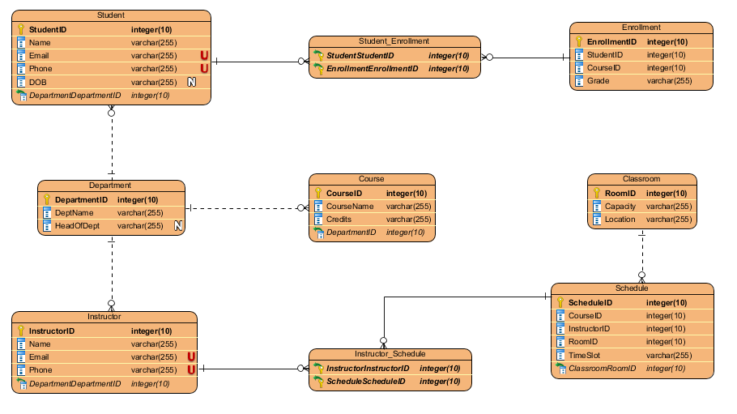

# 📘 DBMS Assignments – University Management System

Welcome to my DBMS Assignments repository! This folder contains detailed coursework, ER diagrams, and schema designs based on a University Management System. These assignments were created as part of my academic journey to understand and implement real-world database design concepts.

## 📌 Contents

- **Assignment 1: Comparative Study of Modern Database Systems**
  - A comprehensive comparison of SQL vs. NoSQL databases
  - Includes case studies and usage analysis of MySQL, MongoDB, and Cassandra
- **Assignment 2: University Management System (ER Model + Relational Schema)**
  - Full ER diagram
  - Corresponding relational schema with primary keys, foreign keys, and constraints
  - Design rationale and documentation

## 📊 ER Diagram Preview

The diagram illustrates how these entities relate, including many-to-many relationships and associative tables like `Student_Enrollment` and `Instructor_Schedule`.

## 💡 Objectives

- Practice database design using real-world academic systems
- Implement ER modeling techniques
- Convert ER models into normalized relational schemas
- Understand primary/foreign key usage and relational constraints

Feel free to fork, star, or contribute if you're working on similar database concepts.
